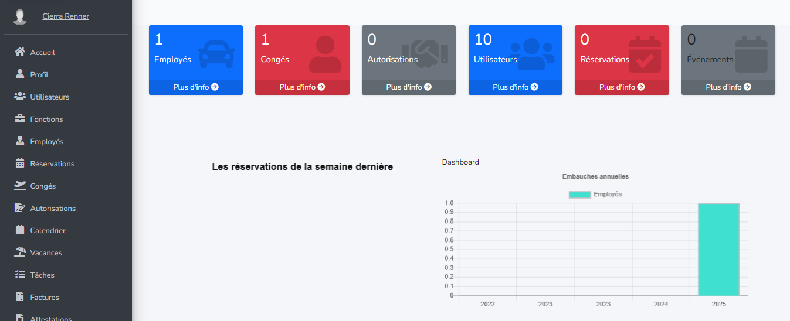
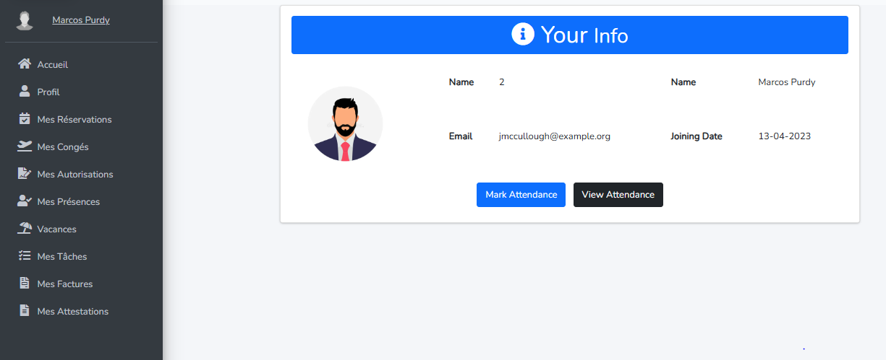
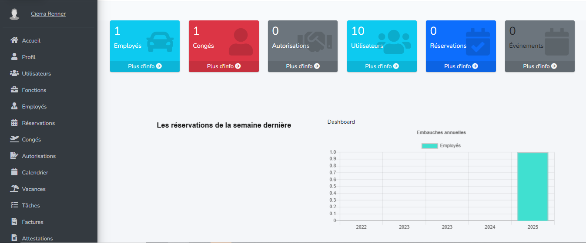

# Projet RH - Gestion des Ressources Humaines

Bienvenue dans le projet **RH**, une application web complète dédiée à la gestion efficace des ressources humaines au sein d'une organisation.

---

## 🛠 Technologies utilisées

- **Laravel** (PHP Framework)  
- **MySQL** (Base de données)  
- **HTML / CSS / JavaScript** (Frontend)  
- **Composer** (Gestion des dépendances)  

---

## ✨ Fonctionnalités principales

- **Gestion des utilisateurs** : Création, modification, gestion des rôles et permissions.  
- **Gestion des employés** : Ajout, modification, suppression et suivi des profils employés.  
- **Gestion des congés** : Demandes, validations et suivi des congés.  
- **Gestion des attestations** : Génération et gestion des attestations diverses.  
- **Gestion des vacances** : Planification et suivi des périodes de vacances.  
- **Gestion des tâches** : Assignation, suivi et validation des tâches.  
- **Gestion des présences** : Enregistrement et consultation des présences quotidiennes.  
- **Gestion des réservations** : Gestion des réservations internes (salles, équipements, etc.).  
- **Gestion des autorisations** : Gestion des autorisations spéciales et accès.  
- **Gestion des factures** : Création, suivi et archivage des factures liées aux services RH.  

---
### Interface Admin

### Interface Utilisateur

### Module Authentification

Accès sécurisé par login et mot de passe
Deux types de profils sont gérés par l’application :
👤 Administrateur
👤 Utilisateur
Un administrateur principal est déjà préconfiguré pour la première connexion :
Mot de passe : password

## 📂 Dossier des captures d'écran

Toutes les captures d’écran utilisées dans ce projet sont disponibles dans le dossier [`/screenshots`](screenshots/).

## 🚀 Téléchargement & Installation détaillée

Suivez ces étapes pour télécharger et installer le projet localement :

- cd RH
- composer install
- Ouvrez .env avec un éditeur de texte et modifiez les paramètres de connexion à la base de données (DB_DATABASE, DB_USERNAME, DB_PASSWORD).
- php artisan key:generate
- php artisan migrate
- php artisan db:seed
- php artisan serve
Accéder à l’application
Ouvrez votre navigateur et rendez-vous sur : http://localhost:8000
